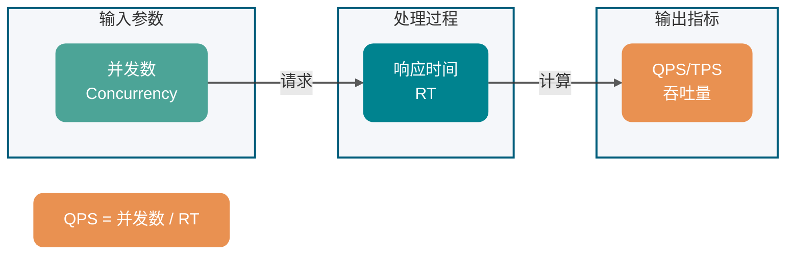
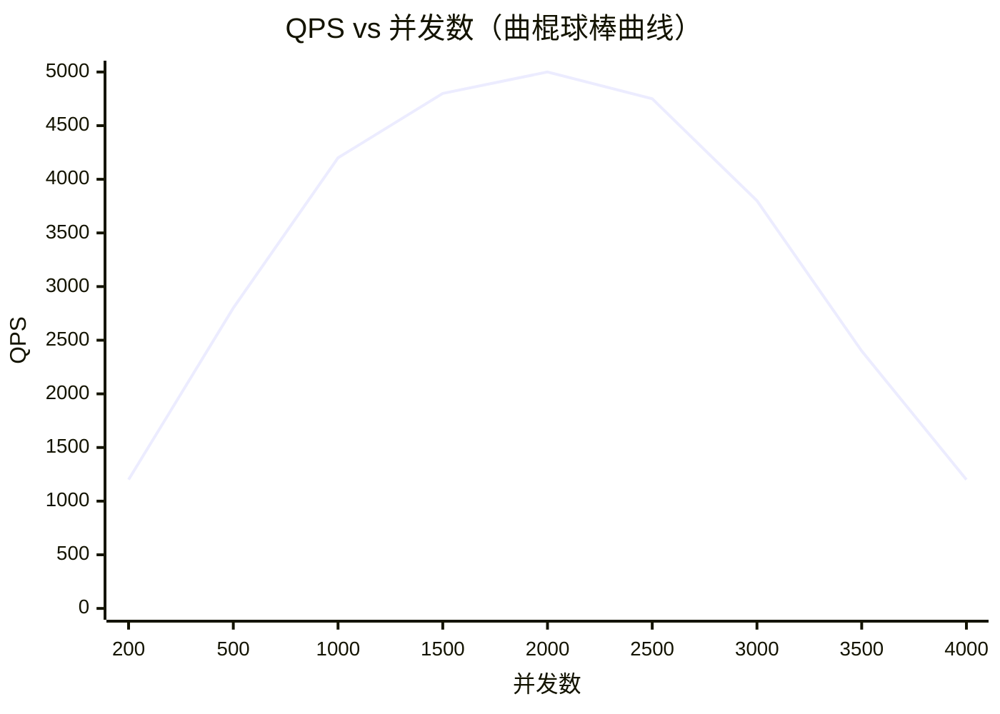

性能测试一般情况下都是由测试这个职位去做的，那还需要我们开发学这个干嘛呢？了解性能测试的指标、分类以及工具等知识有助于我们更好地去写出性能更好的程序，另外作为开发这个角色，如果你会性能测试的话，相信也会为你的履历加分不少。

这篇文章是我会结合自己的实际经历以及在测试这里取的经所得，除此之外，我还借鉴了一些优秀书籍，希望对你有帮助。

## 不同角色看网站性能

### 用户

当用户打开一个网站的时候，最关注的是什么？当然是 **网站响应速度的快慢**。比如我们点击了淘宝的主页，淘宝需要多久将首页的内容呈现在我的面前，我点击了提交订单按钮需要多久返回结果等等。

所以，用户在体验我们系统的时候往往根据你的响应速度的快慢来评判你的网站的性能。

### 开发人员

用户与开发人员都关注速度，这个速度实际上就是我们的系统 **处理用户请求的速度**。

开发人员一般情况下很难直观的去评判自己网站的性能，我们往往会根据网站当前的架构以及基础设施情况给一个大概的值，比如：

1. 项目架构是分布式的吗？
2. 用到了缓存和消息队列没有？
3. 高并发的业务有没有特殊处理？
4. 数据库设计是否合理？
5. 系统用到的算法是否还需要优化？
6. 系统是否存在内存泄漏的问题？
7. 项目使用的 Redis 缓存多大？服务器性能如何？用的是机械硬盘还是固态硬盘？
8. ……

### 测试人员

测试人员一般会根据性能测试工具来测试，然后一般会做出一个表格。这个表格可能会涵盖下面这些重要的内容：

1. 响应时间；
2. 请求成功率；
3. 吞吐量；
4. ……

### 运维人员

运维人员会倾向于根据 **基础设施和资源的利用率** 来判断网站的性能，比如我们的服务器资源使用是否合理、数据库资源是否存在滥用的情况、当然，这是传统的运维人员，现在 Devops 火起来后，单纯干运维的很少了。我们这里暂且还保留有这个角色。

## 性能测试需要注意的点

几乎没有文章在讲性能测试的时候提到这个问题，大家都会讲如何去性能测试，有哪些性能测试指标这些东西。

### 了解系统的业务场景

**性能测试之前更需要你了解当前的系统的业务场景。** 对系统业务了解的不够深刻，我们很容易犯测试方向偏执的错误，从而导致我们忽略了对系统某些更需要性能测试的地方进行测试。

比如我们的系统可以为用户提供发送邮件的功能，用户配置成功邮箱后只需输入相应的邮箱之后就能发送，系统每天大概能处理上万次发邮件的请求。很多人看到这个可能就直接开始使用相关工具测试邮箱发送接口，但是，发送邮件这个场景可能不是当前系统的性能瓶颈，这么多人用我们的系统发邮件，还可能有很多人一起发邮件，单单这个场景就这么人用，那用户管理可能才是性能瓶颈吧！

### 历史数据非常有用

当前系统所留下的历史数据非常重要，一般情况下，我们可以通过相应的些历史数据初步判定这个系统哪些接口调用的比较多、哪些服务承受的压力最大，这样的话，我们就可以针对这些地方进行更细致的性能测试与分析。

另外，这些地方也就像这个系统的一个短板一样，优化好了这些地方会为我们的系统带来质的提升。

## 常见性能指标

性能指标是衡量系统性能的核心度量标准，理解各指标之间的关系对于性能分析至关重要。

### 响应时间

**响应时间 RT（Response Time）** 是用户发出请求到收到系统处理结果所需的时间，包括网络传输、服务端处理与客户端渲染等环节。

**响应时间指标（Latency Percentiles）**：生产环境中看平均 RT 毫无意义，必须监控 **P90、P99 和 P999** 分位值。例如 P99 = 500ms 意味着 99% 的请求在 500ms 内返回。那 1% 的长尾慢调用（可能由 Cache Miss、慢 SQL 或 GC STW 引起）在极高并发下会发生排队效应，瞬间打满网关或 RPC 框架的底层工作线程池，直接引发雪崩。大量超快响应会拉低平均值，掩盖致命的长尾问题，此为典型的 **"均值陷阱"**。

分位值参考标准如下：

| 分位值 | RT 范围（示例） | 说明                     |
| ------ | --------------- | ------------------------ |
| P90    | < 200ms         | 90% 的请求在此时间内返回 |
| P99    | < 500ms         | 重点关注，长尾用户体感   |
| P999   | < 1s            | 极端场景，易触发雪崩     |

> **失败模式**：当发生网络偶发抖动时，P999 RT 会急剧飙升。若上游缺乏超时截断机制（Timeout & Circuit Breaking），大量并发请求将被挂起，导致上游节点内存 OOM。

### 并发数

**并发数可以简单理解为系统能够同时供多少人访问使用，也就是说系统同时能处理的请求数量。**

并发数反应了系统的 **负载能力**。需要注意区分以下概念：

- **并发用户数**：同时在线的用户数量。
- **并发请求数**：同一时刻系统正在处理的请求数量。
- **最大并发数**：系统能够承受的最大并发请求数，超过此值系统可能出现性能下降或崩溃。

### QPS 和 TPS

- **QPS（Query Per Second）**：服务器每秒可执行的查询次数；
- **TPS（Transaction Per Second）**：服务器每秒处理的事务数（一次完整业务操作）。

> QPS vs TPS：一次页面访问形成 1 个 TPS，但可能产生多次对服务器的请求（计入 QPS）。**TPS 偏向业务视角，QPS 偏向技术视角。**

### 吞吐量

**吞吐量** 指系统单位时间内处理的请求数量。TPS、QPS 是常用量化指标。

**Little's Law（利特尔法则）**：在系统未饱和的稳态下，`并发数 = QPS × RT`，亦即 `QPS = 并发数 / RT`。该公式仅在系统处于线性响应区间时成立。随着并发用户数持续增加，CPU 调度消耗、锁争用（Lock Contention）加剧，RT 会呈现 **指数级上升**，吞吐量达到拐点后急速下降，形成典型的 **"曲棍球棒曲线"（Hockey Stick Curve）**。下图直观展示「为什么不能用公式硬算」：拐点之后 QPS 不升反降，系统已进入非线性区。

因此，绝不能仅靠公式推算生产容量，必须通过全链路压测验证真实极限。

## 系统活跃度指标

### PV（Page View）

**访问量**，即页面浏览量或点击量，衡量网站用户访问的网页数量；在一定统计周期内用户每打开或刷新一个页面就记录 1 次，多次打开或刷新同一页面则浏览量累计。PV 从网页打开的数量/刷新的次数的角度来统计的。

### UV（Unique Visitor）

**独立访客**，统计 1 天内访问某站点的用户数。1 天内相同访客多次访问网站，只计算为 1 个独立访客。UV 是从用户个体的角度来统计的。

### DAU（Daily Active User）

**日活跃用户数量**，指一天内登录或使用产品的用户数（去重）。

### MAU（Monthly Active Users）

**月活跃用户人数**，指一个月内登录或使用产品的用户数（去重）。

### 实战计算示例

> **生产级容量评估**：绝不能用 DAU 乘以固定系数去估算峰值。真实峰值往往来自特定业务场景（如整点秒杀、大促开抢）。随着并发用户数（Virtual Users）持续增加，系统 CPU 调度消耗、锁争用加剧，RT 会呈现指数级上升，此时吞吐量会达到拐点并急速下降。必须通过 **全链路压测**（结合真实流量录制与回放，如 [GoReplay](https://goreplay.org/)）来摸底真实的吞吐量极限，而非纸上公式推算。

## 性能测试分类

| 测试类型       | 目的                       | 测试方法                                |
| -------------- | -------------------------- | --------------------------------------- |
| **性能测试**   | 验证系统性能是否满足预期   | 在已知性能指标下验证                    |
| **负载测试**   | 找到系统的性能上限         | 逐步加压直到资源饱和                    |
| **压力测试**   | 测试极限、背压与自愈能力   | 持续加压验证崩溃后行为（429/503、自愈） |
| **稳定性测试** | 验证系统长时间运行的稳定性 | 模拟真实场景持续运行                    |

**负载测试 vs 压力测试的水位边界**：二者区别在于「加压到哪里为止」。下图帮助建立直观水位线：负载测试在**资源饱和线**止步（找到上限）；压力测试继续加压**越过饱和线**，直到崩溃并验证背压与自愈。

### 性能测试

性能测试方法是通过测试工具模拟用户请求系统，目的主要是为了测试系统的性能是否满足要求。通俗地说，这种方法就是要在特定的运行条件下验证系统的能力状态。

性能测试是你在 **对系统性能已经有了解的前提之后** 进行的，并且有明确的性能指标。

### 负载测试

对被测试的系统继续加大请求压力，直到服务器的某个资源已经达到饱和了，比如系统的缓存已经不够用了或者系统的响应时间已经不满足要求了。

**负载测试说白点就是测试系统的上限。**

### 压力测试

不去管系统资源的使用情况，对系统持续加大请求压力，**直到系统崩溃**。压力测试的核心目的不仅是寻找崩溃点，更是验证系统在过载状态下的 **背压（Backpressure）容错性**。当并发数超越承载极限时，必须验证系统能否主动阻断流量（如返回 HTTP 429 Too Many Requests、503 Service Unavailable），避免节点假死。同时，需验证在撤除越线流量后，系统是否能自动释放挂起的连接并恢复至正常吞吐能力（**自愈性**）。这种"崩溃后行为"的验证是混沌工程与高可用架构的最佳实践。

### 稳定性测试

模拟真实场景，给系统一定压力，看看业务是否能稳定运行。稳定性测试通常需要运行较长时间（如 7×24 小时），观察系统是否存在 **内存泄漏、连接泄漏** 等问题。

## 常用性能测试工具

### 后端常用

既然系统设计涉及到系统性能方面的问题，那在面试的时候，面试官就很可能会问：**你是如何进行性能测试的？**

推荐 4 个比较常用的性能测试工具：

| 工具           | 开发语言 | 特点                                  | 适用场景                 |
| -------------- | -------- | ------------------------------------- | ------------------------ |
| **JMeter**     | Java     | 功能全面，支持 GUI 和命令行，插件丰富 | 复杂场景测试、企业级应用 |
| **Gatling**    | Scala    | 基于 Akka，代码驱动，报告美观         | 高并发场景、CI/CD 集成   |
| **ab**         | C        | 轻量简单，Apache 自带                 | 快速接口测试、基准测试   |
| **LoadRunner** | -        | 商业软件，功能强大                    | 企业级大规模测试         |

没记错的话，除了 **LoadRunner** 其他几款性能测试工具都是开源免费的。

**选型建议：**

- **快速验证**：使用 `ab` 或 `wrk` 进行简单的接口压测。
- **复杂场景**：使用 `JMeter`，支持录制脚本、参数化、断言等功能。
- **代码驱动**：使用 `Gatling`，适合开发人员，易于版本控制和 CI 集成。

### 前端常用

1. **Fiddler**：抓包工具，它可以修改请求的数据，甚至可以修改服务器返回的数据，功能非常强大，是 Web 调试的利器。
2. **HttpWatch**：可用于录制 HTTP 请求信息的工具。

## 常见的性能优化策略

性能优化之前我们需要对请求经历的各个环节进行分析，排查出可能出现性能瓶颈的地方，定位问题。

下面是一些性能优化时，我经常拿来自问的一些问题：

| 优化方向   | 检查项                                                   |
| ---------- | -------------------------------------------------------- |
| **缓存**   | 系统是否需要缓存？热点数据是否已缓存？                   |
| **架构**   | 系统架构本身是不是就有问题？是否需要读写分离、分库分表？ |
| **并发**   | 系统是否存在死锁的地方？锁的粒度是否合理？               |
| **内存**   | 系统是否存在内存泄漏？GC 是否频繁？                      |
| **数据库** | 数据库索引使用是否合理？是否存在慢 SQL？                 |
| **算法**   | 核心算法的时间复杂度是否可以优化？                       |
| **IO**     | 是否存在不必要的网络调用？是否可以批量操作？             |

<!-- @include: @article-footer.snippet.md -->
